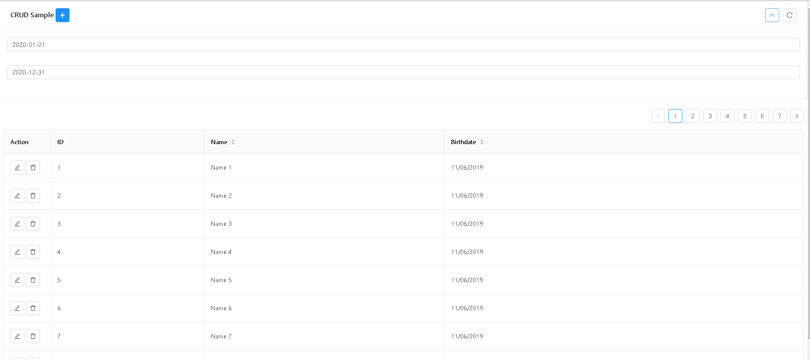
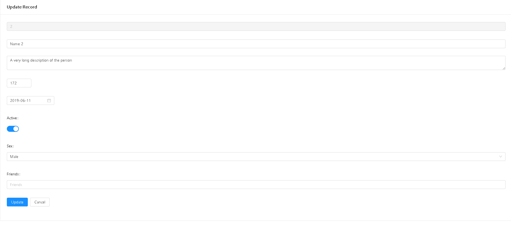

# vue-ant-crud

This is a simple VueJS Crud component using Ant Design as the UI Framework

Reduce boilerplate code. Hopefully it will be able to meet your use case...

Its VueJS cousin is at https://github.com/ais-one/vue-ant-crud

[](./screenshot0.png)

Features
 - page
 - filter
 - sort
 - configure form inputs based on data type
 - crud

[](./screenshot1.png)

## Must Do

Install the packages

```
npm i
```

## Try Out Example

```
npm run serve
```

## Using It In Your Own Project

1. Installing it

```
npm i vue-ant-crud
```

2. Include Ant Design in your project

https://vue.ant.design/docs/vue/getting-started/

You can try full import (easier) or a-la-carte (harder but produces smaller code)


```
// full import snippet (in main.js)
import Vue from 'vue'
import Antd from 'ant-design-vue'
import 'ant-design-vue/dist/antd.css'
...
Vue.use(Antd)
...
```

3. Using it (App.vue)

```
<template>
  <div id="app">
    <vue-ant-crud v-bind="sample" />
  </div>
</template>

<script>
import VueAntCrud from './lib/VueAntCrud.vue'
import * as sample from './sample'

export default {
  name: 'app',
  components: {
    VueAntCrud
  },
  data () {
    return {
      sample: sample 
    }
  }
}
</script>
```

Refer to sample.js, for a more or less complete example of configuration...


## Configuration

Refer to the sample.js Config File

1. constants

2. oprations - find, findOne, update, insert, remove

3. form fields

Supported Ant Design Form Inputs
- Input
- Input.TextArea
- Input Number
- Select (single, multiple)
- DatePicker
- TimePicker
- Switch
- File Upload (work in progress)
- Tree (under consideration)
- Transfer (under consideration)
- Slider (under consideration)

Notes:
  The following properties of Form Inputs are used by this library
  - value
  - onChange
  For other properties
  - should be ok to use, but be careful if it is a function
  - be careful of event functions, may not work via the config file

4. table columns


## Building The Source For NPM

```
npm run build-lib
```


## Test Package Locally

```
npm pack

# before running next comment
# 1. make sure version matches
# 2. make sure you change the "name" property in package.json, and change it back after you fininsh with the command below
npm i --no-save vue-ant-crud-x.x.x.tgz
```

Make sure you include the build library and not the source file

## Notes

How to make your own React Component and publish on NPM

https://medium.com/recraftrelic/building-a-react-component-as-a-npm-module-18308d4ccde9


---


## Project setup
```
npm install
```

### Compiles and hot-reloads for development
```
npm run serve
```

### Compiles and minifies for production
```
npm run build
```

### Run your tests
```
npm run test
```

### Lints and fixes files
```
npm run lint
```

### Customize configuration
See [Configuration Reference](https://cli.vuejs.org/config/).


### Building as package for NPM
```
npm run build-lib
```


## Build For NPM

create npm account

npm login

create vue project

"build-lib": "vue-cli-service build --prod --target lib --name VueCrudX --formats commonjs ./src/VueCrudX.vue&&mv ./dist/VueCrudX.common.js ./dist/VueCrudX.js"

"main": "dist/VueCrudX.common.js"